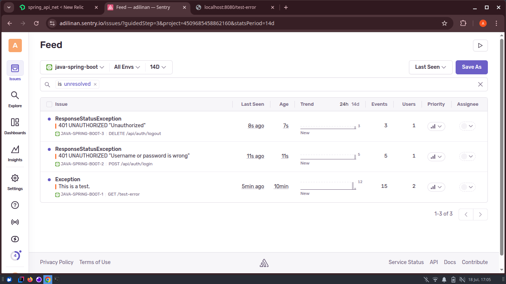
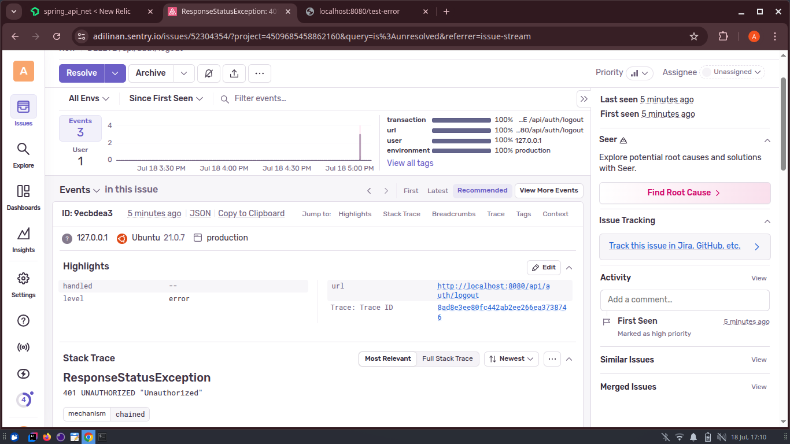
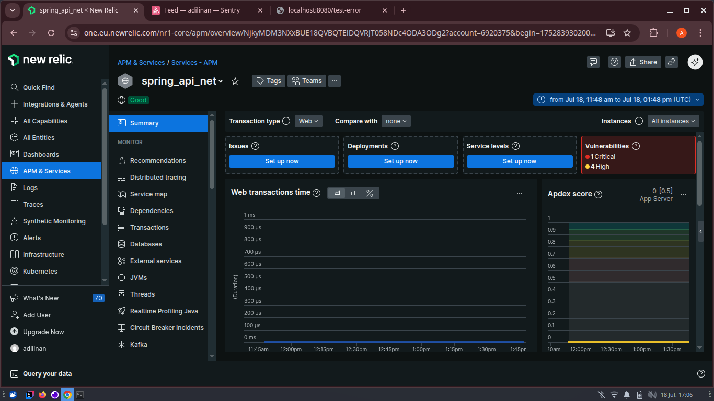

# 🚀 Spring API PZN – Dockerized, CI/CD, and Monitoring Integrated

This project is a modified version of the original `Spring_API_PZN` application.  
It has been enhanced with Docker, Docker Compose, CI/CD using GitHub Actions, and integrated monitoring tools such as Sentry and New Relic.

---

## 🛠️ Technologies Used

- **Spring Boot** – RESTful API backend
- **Docker & Docker Compose** – Containerization and service orchestration
- **GitHub Actions** – Continuous Integration and Deployment
- **Sentry** – Real-time error monitoring
- **New Relic** – Observability and performance monitoring
- **Docker Hub** – Hosting Docker images

---

## 🐳 Docker Integration

### 1. Dockerfile

A `Dockerfile` has been added to package the Spring Boot application into a Docker image.

### 2. Docker Compose

A `docker-compose.yml` file allows the application and its dependencies (such as PostgreSQL) to be run together seamlessly.

> ⚠️ **Note:**  
> This setup **requires a `.env` file**, which is **not included in this repository** for security reasons.  
> Please contact me at [adilinan72@gmail.com](mailto:adilinan72@gmail.com) if you need it.

#### Example `.env` file:

```env
SPRING_DATASOURCE_USERNAME=user
SPRING_DATASOURCE_PASSWORD=my_pwd
NEW_RELIC_APP_NAME=my_new_relic_name
NEW_RELIC_LICENSE_KEY=my_new_relic_key
SENTRY_DSN=https://examplePublicKey@o0.ingest.sentry.io/0
```

#### 📦 Docker Image

The Docker image is available on Docker Hub and can be pulled with:

```docker pull adilinan/spring-api-pzn```

---
#### ⚙️ CI/CD – GitHub Actions

This project includes a GitHub Actions workflow for continuous integration and deployment.
The workflow is automatically triggered when changes are pushed to the main branch and performs the following:

    ✅ Build the project using Maven

    ✅ Build the Docker image

    ✅ Push the Docker image to Docker Hub (with latest and versioned tags)

Secrets used in the repository:

    DOCKERHUB_USERNAME

    DOCKERHUB_TOKEN
---

#### 🧩 Sentry Integration

Sentry is integrated to monitor runtime errors in real time.
This allows proactive debugging and fast incident resolution.

📸 Example Sentry Dashboard:




---

#### 📊 New Relic Integration

New Relic is integrated to provide observability and performance metrics.
It helps monitor:

    Application response time

    Throughput

    Error rates

    Database and backend service performance

📸 Example New Relic Dashboard:



---

#### 📁 Project Structure
```
Spring_API_PZN/
├── src/                         # Spring Boot source code
├── Dockerfile                   # Docker image builder
├── docker-compose.yml           # Orchestrates containers
├── .env                         # Environment config (not included in repo)
├── .github/workflows/ci-cd.yml # GitHub Actions workflow
└── README.md                    # This documentation
```
---
#### 📬 Contact

To request the .env file or report issues, please reach out:

📧 [adilinan72@gmail.com](mailto:adilinan72@gmail.com)


